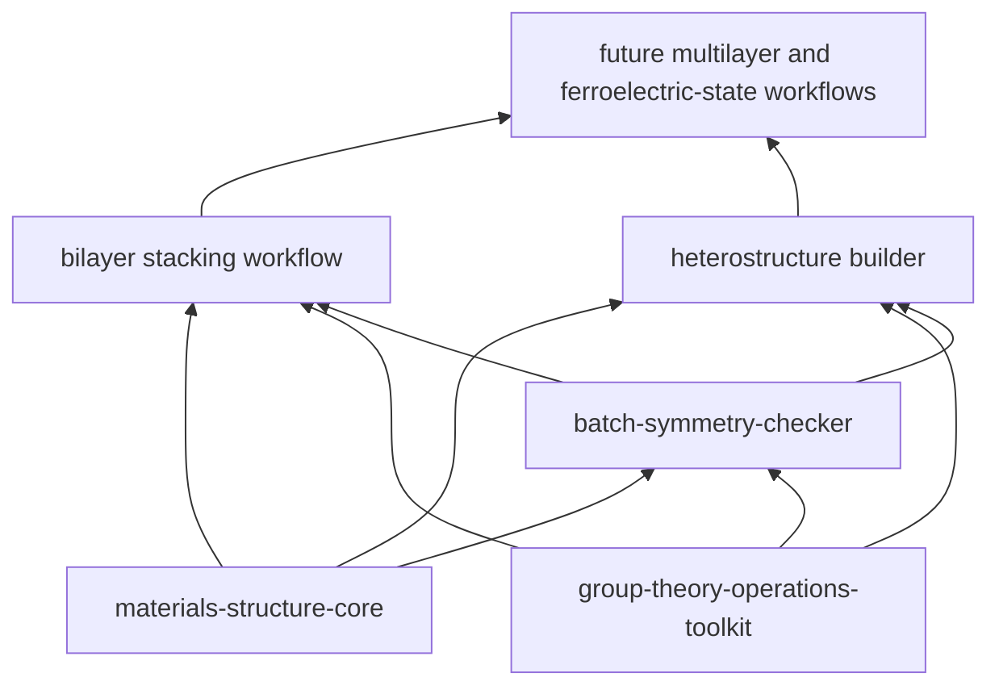

# Jiaqi Xin — Computational Materials & Ferroelectricity

I build reproducible research software for crystallographic symmetry, layered-material structures, heterostructures, and ferroelectric-state exploration.

## Research software architecture

The dependency direction is always upward: foundations never import application code. Applications exchange versioned structures, symmetry reports, and provenance manifests instead of copying parsers or scripts.

## Portfolio

| Layer | Repository | Status | Purpose |
|---|---|---:|---|
| Structure foundation | [`materials-structure-core`](https://github.com/Xin-Jiaqi/materials-structure-core) | experimental | Structure contracts, coordinate transforms, validation, hashing, provenance, and regression fixtures |
| Symmetry foundation | [`group-theory-operations-toolkit`](https://github.com/Xin-Jiaqi/group-theory-operations-toolkit) | validated-data / pre-release | Machine-readable crystallographic operations, matrices, and verified multiplication tables |
| Analysis | [`batch-symmetry-checker`](https://github.com/Xin-Jiaqi/batch-symmetry-checker) | alpha | Batch symmetry analysis and tolerance-robust reporting |
| Layered-material application | [`extension-to-BSF`](https://github.com/Xin-Jiaqi/extension-to-BSF) | experimental | Bilayer stacking and sliding-workflow research prototype |
| Heterostructure application | [`heterojunction`](https://github.com/Xin-Jiaqi/heterojunction) | legacy | Historical prototype; a validated Python 3 redesign is planned |

Personal and web projects are intentionally outside the materials-software dependency graph: [`weread-calendar`](https://github.com/Xin-Jiaqi/weread-calendar), [`Xin-Jiaqi.github.io`](https://github.com/Xin-Jiaqi/Xin-Jiaqi.github.io), and [`minimal-academic-homepage`](https://github.com/Xin-Jiaqi/minimal-academic-homepage).

## Current 90-day focus

1. Establish reliable structure contracts and synthetic regression fixtures.
2. Turn symmetry analysis into a reusable library plus CLI.
3. Repair and validate bilayer structure generation before scientific reuse.
4. Rebuild the heterostructure workflow in Python 3 with strain, spacing, and collision checks.
5. Prepare reproducible releases and complete IP/public-disclosure review before publishing novel screening methods.

See [the portfolio architecture](docs/PORTFOLIO_ARCHITECTURE.md), [the executable roadmap](ROADMAP.md), [the maintenance workflow](docs/MAINTENANCE_WORKFLOW.md), [the ecosystem/prior-art map](docs/ECOSYSTEM_AND_PRIOR_ART.md), and [the IP/public-disclosure gate](docs/IP_AND_DISCLOSURE_GATE.md).

## Quality principles

- Scientific invariants and provenance are part of the API.
- Every P0/P1 scientific fix requires a fixture, regression test, and independent review.
- Public visibility does not imply an open-source license; each repository states its own code, data, and asset rights.
- Unpublished algorithms, scoring functions, candidate lists, and technical-effect data stay private until ownership and patent review are complete.
